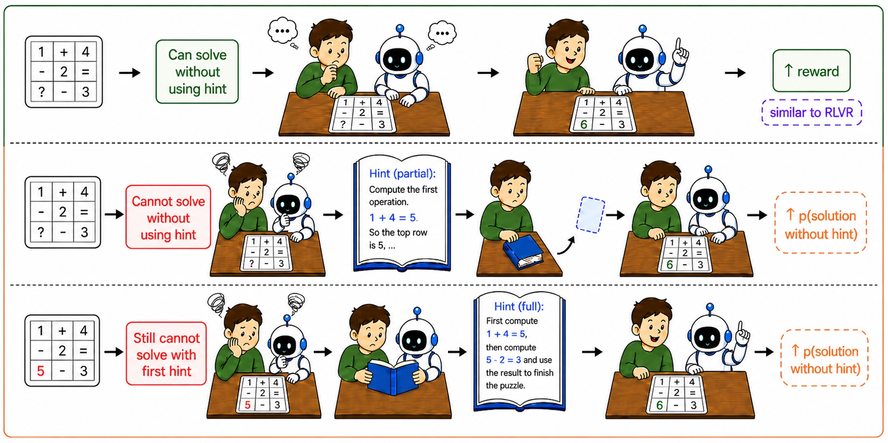
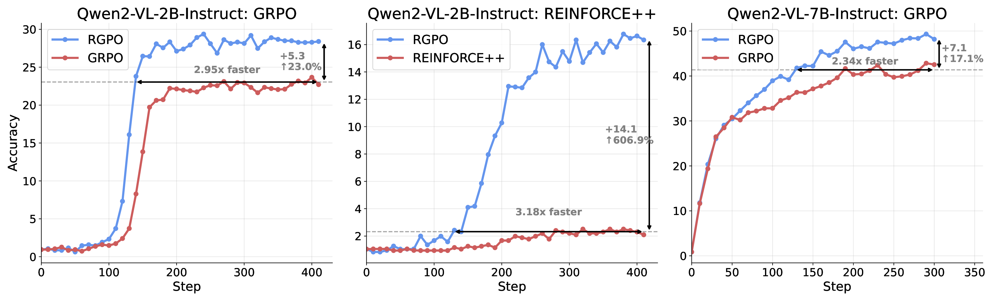

<div align="center">

# Rationale-Guided Policy Optimization: Learning to Reason with Adaptive Rationale Scaffolding

[](https://arxiv.org/abs/2610.07342)


</div>

<p align="center"></p>
<p align="center"><em><b>Figure 1. Overview of the proposed method:</b> Inspired by how humans approach a problem, the model first tries to solve each problem without access to hints. When it succeeds, the correct response is directly reinforced. When it fails, progressively stronger rationales are introduced as temporary scaffolds to guide the model toward a correct solution.</em></p>

**TL;DR.** Reinforcement learning with verifiable rewards (RLVR) gets little useful signal from a problem when every attempt fails. **RGPO** lets the model try again, revealing part of the reference solution on problems it could not solve, and keeps the new answer only if it scores higher than what the model managed alone. The kept answer is then learned *without* the hint, so the reference acts as a temporary *scaffold* rather than a target to copy, and no hint is needed at test time.

- **Language models.** On Qwen2.5-3B, RGPO lifts the in-distribution math average to **26.8**, against 19.7 for GRPO and 21.8 for HINT, the strongest baseline.
- **Vision-language models.** Trained with RGPO, Qwen2-VL-7B reaches **73.65** on MathVista-Math and **70.1** on MMStar-Math (base model: 41.11 and 46.4), the highest among the compared models.
- **Faster learning.** On Qwen2-VL-2B, RGPO matches GRPO's final accuracy in **2.95×** fewer training steps.

## Why RGPO?

On-policy reinforcement learning remains fundamentally constrained by the current capability of the policy model. When the model is trained on problems beyond its evolving reasoning ability, all sampled rollouts for a prompt may be incorrect: rewards become sparse or uniform, and the training process can stagnate precisely on the hard examples that are most important for improving reasoning. A natural direction for mitigating reward sparsity is to incorporate external guidance, such as reference solutions or expert traces. However, maximizing the likelihood of those reference solutions may force the model to imitate trajectories that are far from its own policy distribution, causing distribution mismatch, memorization, and limited generalization.

Human learning research suggests that effective reasoning instruction requires a careful balance between independent problem solving and guided assistance. Learners benefit from attempting a problem before receiving explicit instruction; at the same time, too little help may leave them stuck, whereas too much help may reduce effort, encourage shallow processing, and weaken transfer. Motivated by this perspective, RGPO builds on the standard RLVR training loop and uses reference rationales as temporary scaffolds for exploration rather than as direct imitation targets.


### Language models


<table>
<thead>
<tr><th rowspan="2">Methods</th><th colspan="4">In-Distribution</th><th rowspan="2">Avg</th><th colspan="3">Out-of-Distribution</th><th rowspan="2">Avg</th></tr>
<tr><th>AIME</th><th>Math</th><th>Olympiad</th><th>Minerva</th><th>ARC</th><th>GPQA-D</th><th>MMLU-Pro</th></tr>
</thead>
<tbody>
<tr><td>Vanilla</td><td>2.9</td><td>39.8</td><td>12.0</td><td>9.8</td><td>16.1</td><td>44.8</td><td>11.4</td><td>28.8</td><td>28.3</td></tr>
<tr><td>GRPO</td><td>4.3</td><td>44.0</td><td>18.2</td><td>12.2</td><td>19.7</td><td>45.0</td><td>11.8</td><td>28.0</td><td>28.3</td></tr>
<tr><td>CHORD</td><td>4.5</td><td>46.6</td><td>20.2</td><td>13.0</td><td>21.1</td><td>40.0</td><td>11.0</td><td>26.4</td><td>25.8</td></tr>
<tr><td>LUFFY</td><td>3.3</td><td>40.0</td><td>18.0</td><td>13.2</td><td>18.6</td><td>40.8</td><td>11.2</td><td>24.0</td><td>25.3</td></tr>
<tr><td>GHPO</td><td>4.0</td><td>42.2</td><td>19.6</td><td>12.8</td><td>19.7</td><td>45.5</td><td><ins>12.0</ins></td><td>28.2</td><td>28.6</td></tr>
<tr><td>QuestA</td><td>3.9</td><td>42.0</td><td>19.6</td><td>12.4</td><td>19.5</td><td>44.8</td><td><ins>12.0</ins></td><td>29.0</td><td>28.6</td></tr>
<tr><td>BREAD</td><td>4.1</td><td>44.4</td><td><ins>20.4</ins></td><td><ins>13.4</ins></td><td>20.6</td><td>45.5</td><td>11.8</td><td>29.2</td><td>28.8</td></tr>
<tr><td>HINT</td><td><ins>4.9</ins></td><td><ins>48.6</ins></td><td>20.2</td><td><ins>13.4</ins></td><td><ins>21.8</ins></td><td><ins>48.8</ins></td><td>11.8</td><td><ins>30.2</ins></td><td><ins>29.9</ins></td></tr>
<tr><td>RGPO</td><td><b>5.1</b></td><td><b>55.2</b></td><td><b>24.9</b></td><td><b>22.1</b></td><td><b>26.8</b></td><td><b>51.2</b></td><td><b>14.7</b></td><td><b>30.8</b></td><td><b>32.2</b></td></tr>
</tbody>
</table>


### Vision-language models


<table>
<thead>
<tr><th rowspan="2">Model</th><th rowspan="2">MMStar-Math</th><th colspan="5">MathVista-Math</th></tr>
<tr><th>All</th><th>GEO</th><th>ALG</th><th>GPS</th><th>TQA</th></tr>
</thead>
<tbody>
<tr><td>LLaVA-OneVision-Qwen2-7b-ov</td><td>–</td><td>67.04</td><td>69.34</td><td>67.04</td><td>69.71</td><td>58.06</td></tr>
<tr><td>InternVL2-8B</td><td>66.8</td><td>62.59</td><td>62.26</td><td>62.92</td><td>62.50</td><td>62.90</td></tr>
<tr><td>InternVL2-8B-MPO</td><td>–</td><td>68.52</td><td>68.87</td><td>68.91</td><td>69.71</td><td>64.52</td></tr>
<tr><td>DeepSeek-VL2</td><td>–</td><td>65.56</td><td>63.68</td><td>65.54</td><td>63.94</td><td>70.97</td></tr>
<tr><td>Qwen2.5-VL-7B-Instruct</td><td>66.8</td><td>66.66</td><td>65.56</td><td>66.29</td><td>65.87</td><td>69.35</td></tr>
<tr><td>Open-R1-Multimodal</td><td>59.2</td><td>54.81</td><td>52.36</td><td>54.68</td><td>53.37</td><td>59.68</td></tr>
<tr><td>R1-VL-7B</td><td>68.4</td><td>69.63</td><td>68.87</td><td>69.66</td><td>69.71</td><td>69.35</td></tr>
<tr><td>Mulberry</td><td>66.8</td><td>68.52</td><td>67.92</td><td>68.54</td><td>68.75</td><td>67.74</td></tr>
<tr><td>MM-Eureka</td><td>–</td><td><ins>72.59</ins></td><td><ins>71.22</ins></td><td><ins>72.66</ins></td><td><ins>72.60</ins></td><td><b>72.58</b></td></tr>
<tr><td>Qwen2-VL-7B-Instruct</td><td>46.4</td><td>41.11</td><td>35.85</td><td>41.57</td><td>36.54</td><td>56.45</td></tr>
<tr><td>Original Image CoT SFT</td><td>–</td><td>40.37</td><td>38.68</td><td>40.82</td><td>39.42</td><td>43.54</td></tr>
<tr><td>Bounding Box CoT SFT</td><td>–</td><td>65.56</td><td>63.21</td><td>65.54</td><td>63.94</td><td><ins>70.97</ins></td></tr>
<tr><td>Text-only CoT SFT</td><td><ins>67.6</ins></td><td>64.07</td><td>64.15</td><td>64.04</td><td>64.42</td><td>62.90</td></tr>
<tr><td>RGPO</td><td><b>70.1</b></td><td><b>73.65</b></td><td><b>73.47</b></td><td><b>73.62</b></td><td><b>73.89</b></td><td>70.35</td></tr>
</tbody>
</table>

<p align="center"></p>
<p align="center"><em><b>Figure 2. RGPO accelerates and improves RLVR training.</b> Across Qwen2-VL-2B and Qwen2-VL-7B models, RGPO reaches the final performance of RLVR baselines substantially faster and achieves higher final accuracy. The gains are especially pronounced for weaker models and less stable RLVR algorithms (e.g. REINFORCE++).</em></p>

## Getting started

### 1. Install


```bash
git clone https://github.com/VietHoang1512/rgpo.git && cd rgpo
conda create -n rgpo python=3.10 -y && conda activate rgpo
echo "transformers==4.51.3" > constraints.txt && export PIP_CONSTRAINT=$PWD/constraints.txt
cd verl && USE_MEGATRON=0 USE_SGLANG=0 bash scripts/install_vllm_sglang_mcore.sh
pip install --no-deps -e . && rm -f *.whl && cd ..
pip install math-verify regex nltk
python -c "import flash_attn, vllm, verl"
```

### 2. Prepare data

The vision-language recipe trains on [MINT-CoT](https://huggingface.co/datasets/xy06/MINT-CoT-Dataset) and validates on [MathVista](https://huggingface.co/datasets/AI4Math/MathVista) testmini. Run these from the repository root:

```bash
mkdir -p data outputs
hf download xy06/MINT-CoT-Dataset MINT-CoT_interleave_sft_54k.json images.zip \
    --repo-type dataset --local-dir data
unzip -q data/images.zip -d data
python scripts/mint.py
python scripts/mathvista.py
```


### 3. Train

`run.sh` launches RGPO and its baselines. Five positional arguments choose the method; with none, it runs plain GRPO.

```bash
bash run.sh vllm 0.001 True False False    # RGPO, weight 0.001 on kept answers
bash run.sh vllm 0.001 False False False   # GRPO baseline (the weight is unused)
```

## Citation

If you find RGPO useful, please cite:

```bibtex
@article{phan2026rationale,
  title={Rationale-Guided Policy Optimization: Learning to Reason with Adaptive Rationale Scaffolding},
  author={Phan, Hoang and Pham, Minh and Pham, Chau and Hegde, Chinmay and Le, Trung and Lei, Qi},
  journal={arXiv preprint arXiv:2610.07342},
  year={2026}
}
```
